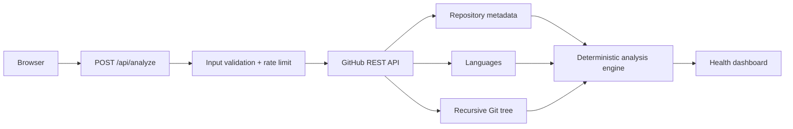

# RepoLens Architecture

RepoLens is a Next.js App Router application designed to keep repository analysis explainable and inexpensive.

## Request flow

Only three GitHub API requests are needed for a normal analysis.

## Trust boundaries

- The browser never receives a GitHub token or GitHub App private key.
- The public analyzer never uses GitHub App installation tokens, preventing anonymous access to installed private repositories.
- Private-repository analysis is deferred until an explicit user-authorization flow exists.
- Repository references are validated before being interpolated into API paths.
- Server requests use a bounded timeout.
- Webhook bodies are verified with HMAC SHA-256 and constant-time comparison.
- Public error responses do not expose secrets or upstream response bodies.
- A lightweight in-memory limiter reduces accidental abuse; production deployments can add a distributed limiter if traffic requires it.

## Scoring

The MVP calculates five independent pillars:

1. Documentation
2. Automation
3. Security
4. Maintenance
5. Engineering

Scores use observable signals such as README, license, tests, workflows, Dependabot, CodeQL, templates, typed languages, repository activity, and lockfiles. No LLM is required.

## GitHub App path

Public repositories can be analyzed anonymously or through a public-only server token. The GitHub App is authenticated independently with an App JWT and signed HMAC webhooks. When GitHub sends an event for a repository, RepoLens invalidates that repository's cached GitHub responses immediately.

Installation-token primitives are implemented for future authorized workflows, but the public analyzer intentionally does not use them. Private-repository analysis will only be enabled after an explicit user-authorization flow exists.
